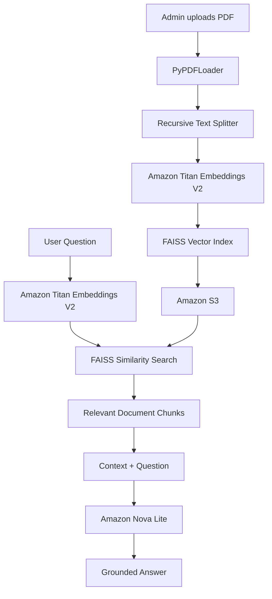

# Bedrock RAG Document Assistant

A containerized Retrieval-Augmented Generation (RAG) application for asking questions about PDF documents using Amazon Bedrock.

The project demonstrates the complete basic RAG workflow:

**PDF → Chunking → Embeddings → Vector Search → Retrieved Context → LLM → Grounded Answer**

---

## Architecture



## Technology Stack

- Python
- Amazon Bedrock
- Amazon Titan Text Embeddings V2
- Amazon Nova Lite
- Amazon S3
- FAISS
- LangChain
- Streamlit
- Boto3
- Docker

---

## Project Structure

```text
bedrock-rag-document-assistant/
├── Admin/
│   ├── admin.py
│   ├── Dockerfile
│   └── requirements.txt
├── User/
│   ├── app.py
│   ├── Dockerfile
│   └── requirements.txt
├── .gitignore
├── LICENSE
└── README.md
```

---

## How It Works

### Admin / Document Ingestion

The Admin application performs the indexing pipeline:

1. Upload a PDF document.
2. Extract text using PyPDFLoader.
3. Split the document into overlapping chunks.
4. Generate embeddings with Amazon Titan Text Embeddings V2.
5. Build a FAISS vector index.
6. Store the FAISS index files in Amazon S3.

The current chunking configuration is:

```text
chunk_size = 1000
chunk_overlap = 200
```

### User / Retrieval and Generation

The User application performs the query pipeline:

1. Download the FAISS index from Amazon S3.
2. Accept a natural-language question.
3. Generate a query embedding using Titan Embeddings V2.
4. Run semantic similarity search against FAISS.
5. Retrieve the most relevant document chunks.
6. Combine the retrieved context with the question.
7. Send the grounded prompt to Amazon Nova Lite.
8. Display the generated response.

If the requested information is not available in the indexed document, the model is instructed not to invent an answer.

---

## Run Locally

### Prerequisites

- Docker
- AWS CLI configured
- Amazon Bedrock access
- Amazon S3 bucket
- Appropriate IAM permissions for Bedrock and S3

Set the environment:

```bash
export AWS_REGION="us-east-1"
export BUCKET_NAME="<your-s3-bucket-name>"
```

### Build Admin Application

```bash
docker build \
  -t bedrock-rag-admin:v1 \
  -f Admin/Dockerfile \
  Admin
```

Run it:

```bash
docker run \
  --name bedrock-rag-admin \
  -p 8083:8083 \
  -e BUCKET_NAME="$BUCKET_NAME" \
  -e AWS_REGION="$AWS_REGION" \
  -v "$HOME/.aws:/root/.aws:ro" \
  bedrock-rag-admin:v1
```

Open:

```text
http://localhost:8083
```

Upload a PDF to create the FAISS vector index.

### Build User Application

```bash
docker build \
  -t bedrock-rag-user:v1 \
  -f User/Dockerfile \
  User
```

Run it:

```bash
docker run \
  --name bedrock-rag-user \
  -p 8084:8084 \
  -e BUCKET_NAME="$BUCKET_NAME" \
  -e AWS_REGION="$AWS_REGION" \
  -e BEDROCK_MODEL_ID="amazon.nova-lite-v1:0" \
  -v "$HOME/.aws:/root/.aws:ro" \
  bedrock-rag-user:v1
```

Open:

```text
http://localhost:8084
```

---

## Example

A document-grounded question:

```text
What is the title of the study described in this document?
```

The system retrieves the relevant document chunks and generates an answer based on that context.

An unrelated question:

```text
Who won the 2022 FIFA World Cup?
```

Expected response:

```text
I don't know based on the indexed document.
```

This demonstrates basic grounding behavior and helps reduce hallucination from unrelated model knowledge.

---

## Key Concepts Demonstrated

- Retrieval-Augmented Generation
- PDF ingestion
- Document chunking
- Vector embeddings
- Semantic similarity search
- FAISS vector indexing
- Prompt grounding
- Amazon Bedrock model invocation
- S3-based vector-index persistence
- Docker containerization
- Separation of ingestion and retrieval workloads

---

## Security Notes

AWS credentials are not committed to this repository.

For local development, the Docker containers mount the local AWS credentials directory as read-only.

For deployments on services such as Amazon ECS or Amazon EKS, IAM roles should be used instead of mounted local credentials.

The FAISS serialized index should only be loaded from trusted sources.

---
---
---
---
---

## License

MIT License. See `LICENSE`.
