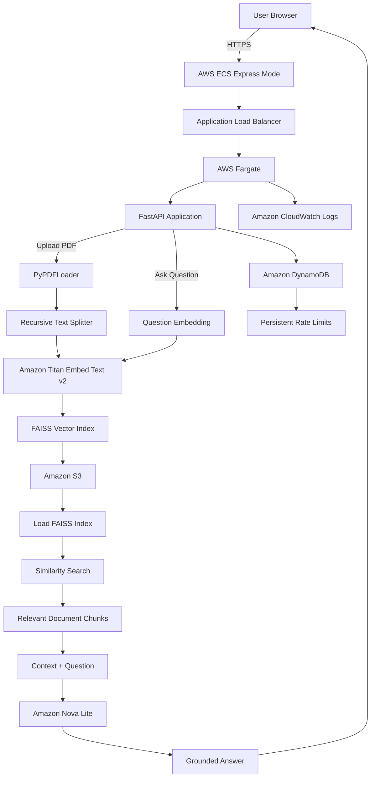

# Bedrock RAG Document Assistant

A production-style Retrieval-Augmented Generation (RAG) application that lets users upload PDF documents and ask grounded natural-language questions about their contents using Amazon Bedrock.

The project started as a local Streamlit-based RAG prototype and evolved into a containerized FastAPI application deployed publicly on AWS with Amazon ECS Express Mode, AWS Fargate, Amazon ECR, Amazon S3, Amazon DynamoDB, CloudWatch logging, and IAM-based access control.

**PDF → Chunking → Titan Embeddings → FAISS Retrieval → Relevant Context → Amazon Nova Lite → Grounded Answer**

---

## Live Demo

**Public demo:**  
https://be-015c678cad684056b2ee70bab665ec3d.ecs.us-east-1.on.aws/

A visitor can:

1. Upload a PDF.
2. Automatically create a FAISS vector index.
3. Ask natural-language questions about the uploaded document.
4. Receive answers grounded in retrieved document context.

### Demo Guardrails

The public deployment includes lightweight safeguards to control AWS usage and reduce abuse:

- PDF files only
- Maximum file size: **10 MB**
- Maximum **2 PDF uploads per visitor every 24 hours**
- Maximum **20 questions per visitor every 24 hours**
- Visitor IP addresses are SHA-256 hashed before being used as rate-limit identifiers
- Rate-limit counters are stored in Amazon DynamoDB
- DynamoDB TTL is used to expire rate-limit records automatically

---

## Production Architecture



---

## Core RAG Workflow

### 1. Document Ingestion

When a PDF is uploaded:

1. The application validates that the file is a PDF.
2. The application enforces the 10 MB upload limit.
3. `PyPDFLoader` extracts text from the document.
4. `RecursiveCharacterTextSplitter` divides the document into overlapping chunks.
5. Amazon Titan Embed Text v2 generates vector embeddings.
6. FAISS creates a vector index from the embedded chunks.
7. The FAISS index is persisted to Amazon S3.
8. The application returns a unique `document_id`.

Current chunking configuration:

```text
chunk_size = 1000
chunk_overlap = 200
```

FAISS artifacts are stored using a session-based structure:

```text
sessions/
└── <document_id>/
    ├── index.faiss
    └── index.pkl
```

The raw PDF is removed from temporary container storage after indexing.

### 2. Retrieval and Generation

When a user asks a question:

1. The application receives the `document_id` and question.
2. The corresponding FAISS index is loaded from Amazon S3.
3. The question is embedded with Amazon Titan Embed Text v2.
4. FAISS performs semantic similarity search.
5. Relevant document chunks are retrieved.
6. The retrieved context is combined with the user's question.
7. The grounded prompt is sent to Amazon Nova Lite.
8. The generated answer is returned through the API.

The goal is to make the answer depend on retrieved document context rather than unsupported model knowledge.

---

## Technology Stack

### AI / RAG

- Amazon Bedrock
- Amazon Titan Embed Text v2
- Amazon Nova Lite
- LangChain
- FAISS
- PyPDFLoader
- RecursiveCharacterTextSplitter

### Backend

- Python 3.11
- FastAPI
- Uvicorn
- Pydantic
- Boto3

### AWS

- Amazon ECS Express Mode
- AWS Fargate
- Amazon ECR
- Amazon S3
- Amazon DynamoDB
- Amazon CloudWatch
- AWS IAM
- Application Load Balancer
- Amazon VPC
- Internet Gateway
- Multi-AZ public subnets

### Development

- Docker
- AWS CLI
- Git
- GitHub
- Streamlit

---

## Project Structure

```text
bedrock-rag-document-assistant/
├── Admin/
│   ├── admin.py
│   ├── Dockerfile
│   └── requirements.txt
│
├── User/
│   ├── app.py
│   ├── Dockerfile
│   └── requirements.txt
│
├── FastAPI/
│   ├── app.py
│   ├── Dockerfile
│   └── requirements.txt
│
├── .gitignore
├── LICENSE
└── README.md
```

### `Admin/`

The original Streamlit ingestion application.

Responsibilities:

- PDF upload
- text extraction
- document chunking
- Titan embedding generation
- FAISS index creation
- S3 persistence

### `User/`

The original Streamlit retrieval application.

Responsibilities:

- load FAISS indexes from S3
- accept user questions
- perform similarity search
- build retrieved context
- invoke Amazon Nova Lite
- display grounded answers

### `FastAPI/`

The current production-style application used by the public AWS deployment.

It combines upload and question-answering functionality into one FastAPI service.

---

## API Endpoints

### Home

```http
GET /
```

Returns the browser-based demo interface.

### Health Check

```http
GET /health
```

Example response:

```json
{
  "status": "healthy",
  "service": "bedrock-rag-document-assistant"
}
```

### Upload PDF

```http
POST /api/upload
Content-Type: multipart/form-data
```

The endpoint:

1. validates the file type,
2. enforces the file-size limit,
3. checks the upload rate limit,
4. extracts and chunks the document,
5. generates Titan embeddings,
6. builds the FAISS index,
7. stores the index in Amazon S3,
8. returns a unique `document_id`.

Example response:

```json
{
  "document_id": "generated-document-id",
  "filename": "example.pdf",
  "chunks": 42,
  "status": "ready"
}
```

### Ask a Question

```http
POST /api/ask
Content-Type: application/json
```

Example request:

```json
{
  "document_id": "generated-document-id",
  "question": "What are the main findings of this document?"
}
```

Example response:

```json
{
  "document_id": "generated-document-id",
  "question": "What are the main findings of this document?",
  "answer": "The document reports..."
}
```

---

## Persistent Rate Limiting

Once the application became publicly accessible, unrestricted requests created a potential cloud-cost and abuse risk.

A DynamoDB-backed rate limiter was added to protect the demo.

Each visitor receives a SHA-256-derived identifier based on the source IP observed by the application.

Separate keys are maintained for uploads and questions:

```text
upload#<hashed-visitor-id>
ask#<hashed-visitor-id>
```

Current limits:

```text
Uploads:    2 per visitor / 24 hours
Questions: 20 per visitor / 24 hours
```

The application uses conditional DynamoDB updates so counters remain consistent across application restarts and multiple ECS tasks.

Each record includes an `expires_at` field configured as the DynamoDB TTL attribute.

Example logical record:

```text
rate_key   = ask#<hashed-visitor-id>
count      = 1
expires_at = <unix-epoch-expiration>
```

---

## AWS Deployment

The FastAPI application is packaged as a Docker image and stored in Amazon ECR.

```text
Source Code
    ↓
Docker Build
    ↓
Amazon ECR
    ↓
ECS Express Mode
    ↓
AWS Fargate
    ↓
Application Load Balancer
    ↓
Public HTTPS Endpoint
```

The deployed application runs with IAM roles instead of embedded AWS credentials.

### Application Task Role

The FastAPI task role provides the application with access to:

- Amazon S3
- Amazon Bedrock
- Amazon DynamoDB

### ECS Execution Role

The ECS execution role is used by ECS for container execution responsibilities such as:

- retrieving images from Amazon ECR
- writing container logs to CloudWatch

---

## Networking

The public deployment runs across multiple Availability Zones.

```text
Internet
   ↓
Internet Gateway
   ↓
Public Subnet A + Public Subnet B
   ↓
Application Load Balancer
   ↓
ECS / Fargate
   ↓
FastAPI :8000
```

The FastAPI application listens internally on port `8000`.

ECS Express Mode manages the public HTTPS ingress and load-balancing infrastructure.

---

## Deployment Verification

The public application has been tested end to end.

```text
ECS deployment              ✅
Fargate task running        ✅
Public HTTPS endpoint       ✅
FastAPI health check        ✅
PDF ingestion               ✅
S3 FAISS persistence        ✅
Titan embedding generation  ✅
FAISS similarity retrieval  ✅
Amazon Nova Lite inference  ✅
DynamoDB rate limiting      ✅
CloudWatch logging          ✅
```

A verified production request follows this path:

```text
HTTPS
  ↓
FastAPI
  ↓
DynamoDB Rate Check
  ↓
Amazon S3
  ↓
FAISS
  ↓
Titan Embeddings
  ↓
Relevant Document Context
  ↓
Amazon Nova Lite
  ↓
Grounded Answer
```

---

## Project Evolution

### Phase 1: Local RAG Prototype

The project initially separated ingestion and retrieval into two Streamlit applications:

```text
Admin → Upload and Index Documents
User  → Query Indexed Documents
```

This established the basic RAG workflow.

### Phase 2: Dockerization

The applications were containerized to create reproducible runtime environments and isolate dependencies.

### Phase 3: FastAPI Service

A FastAPI implementation was introduced to provide a cleaner backend interface for cloud deployment.

The service exposes:

```text
GET  /
GET  /health
POST /api/upload
POST /api/ask
```

### Phase 4: Amazon ECR

The FastAPI image was built locally and pushed to Amazon ECR.

Versioned images are used so deployments can be traced and rolled back more safely.

### Phase 5: ECS Express Mode / Fargate

The container was deployed using ECS Express Mode on AWS Fargate.

The deployment provides:

- public HTTPS ingress,
- managed load balancing,
- health checking,
- Fargate compute,
- CloudWatch logging,
- and service deployment monitoring.

### Phase 6: Multi-AZ Networking

The VPC networking was configured with:

- public subnets in multiple Availability Zones,
- an Internet Gateway,
- a default internet route,
- and load-balanced HTTPS ingress.

### Phase 7: Public Demo Hardening

Persistent DynamoDB rate limiting was added after the application became publicly accessible.

This introduced practical controls around:

- public API exposure,
- cloud cost management,
- persistent application state,
- concurrent requests,
- IAM permissions,
- request throttling,
- and abuse prevention.

---

## Run Locally

### Prerequisites

- Python 3.11+
- Docker
- AWS CLI configured
- Amazon Bedrock model access
- Amazon S3 bucket
- DynamoDB rate-limit table
- appropriate AWS permissions

Set environment variables:

```bash
export AWS_REGION="us-east-1"
export BUCKET_NAME="<your-s3-bucket-name>"
export BEDROCK_MODEL_ID="amazon.nova-lite-v1:0"
export RATE_LIMIT_TABLE="bedrock-rag-demo-rate-limits"
```

### Build the FastAPI Container

```bash
docker build \
  -t bedrock-rag-fastapi \
  -f FastAPI/Dockerfile \
  FastAPI
```

### Run the FastAPI Container

```bash
docker run \
  --rm \
  -p 8000:8000 \
  -e AWS_REGION="$AWS_REGION" \
  -e BUCKET_NAME="$BUCKET_NAME" \
  -e BEDROCK_MODEL_ID="$BEDROCK_MODEL_ID" \
  -e RATE_LIMIT_TABLE="$RATE_LIMIT_TABLE" \
  -v "$HOME/.aws:/root/.aws:ro" \
  bedrock-rag-fastapi
```

Open:

```text
http://localhost:8000
```

---

## Original Streamlit Applications

The original project structure is intentionally retained to show the progression from a local prototype to a cloud-hosted FastAPI service.

### Build Admin

```bash
docker build \
  -t bedrock-rag-admin:v1 \
  -f Admin/Dockerfile \
  Admin
```

### Run Admin

```bash
docker run \
  --name bedrock-rag-admin \
  -p 8083:8083 \
  -e BUCKET_NAME="$BUCKET_NAME" \
  -e AWS_REGION="$AWS_REGION" \
  -v "$HOME/.aws:/root/.aws:ro" \
  bedrock-rag-admin:v1
```

### Build User

```bash
docker build \
  -t bedrock-rag-user:v1 \
  -f User/Dockerfile \
  User
```

### Run User

```bash
docker run \
  --name bedrock-rag-user \
  -p 8084:8084 \
  -e BUCKET_NAME="$BUCKET_NAME" \
  -e AWS_REGION="$AWS_REGION" \
  -e BEDROCK_MODEL_ID="amazon.nova-lite-v1:0" \
  -v "$HOME/.aws:/root/.aws:ro" \
  bedrock-rag-user:v1
```

---

## Security Notes

- AWS credentials are not committed to this repository.
- ECS uses IAM roles instead of mounted local AWS credentials.
- Public uploads are restricted to PDF files.
- Individual PDF files are limited to 10 MB.
- Upload and question rates are limited.
- Raw visitor IP addresses are not used directly as DynamoDB rate-limit keys.
- Raw PDFs are removed from temporary container storage after indexing.
- FAISS serialized indexes should only be loaded from trusted application-controlled storage.
- IAM permissions should follow least-privilege principles.

---

## What This Project Demonstrates

This project goes beyond a basic RAG notebook and demonstrates practical experience with:

- Retrieval-Augmented Generation
- PDF ingestion pipelines
- semantic search
- vector embeddings
- FAISS vector indexing
- prompt grounding
- Amazon Bedrock inference
- FastAPI application development
- Docker containerization
- Amazon ECR
- ECS/Fargate deployment
- AWS IAM
- VPC networking
- multi-AZ application deployment
- HTTPS ingress
- Amazon S3 persistence
- DynamoDB conditional updates
- persistent API rate limiting
- CloudWatch logging
- health checks
- cloud cost awareness
- public AI application hardening

---

## Future Improvements

Potential improvements include:

- automated deletion of expired document sessions from S3
- authentication for private deployments
- richer source citations in answers
- streaming responses
- hybrid lexical + vector retrieval
- reranking
- document metadata filtering
- automated CI/CD
- infrastructure as code
- application observability dashboards
- automated integration testing
- custom domain and branded HTTPS endpoint

---

## License

MIT License. See `LICENSE`.
